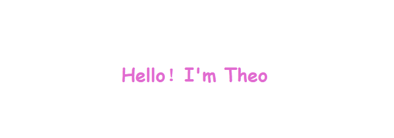

👋 Hey, nice to see you! I’m @Theo Tsang, An EE major student👨‍🎓, from china

**About me**
- 👀 I’m interested in `Embedded Linux`
- 🌱 I’m currently learning `C, C++, Web, Embedded Linux, FPGA...`
- 📜 languages `Chinese, English(passable), German(a little)`
- 📢 welcome my [Blog](https://jan-z.top/about/)

<table><tr><td valign="top" width="50%">
  

  
</td><td valign="top" width="50%">

  

  

  
</td></tr></table>  

<!---
Theo-Tsang/Theo-Tsang is a ✨ special ✨ repository because its `README.md` (this file) appears on your GitHub profile.
You can click the Preview link to take a look at your changes.
--->
